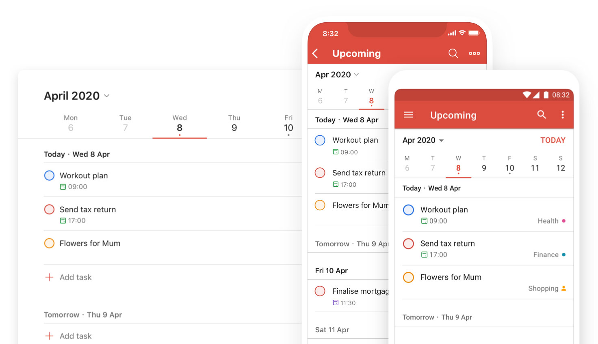
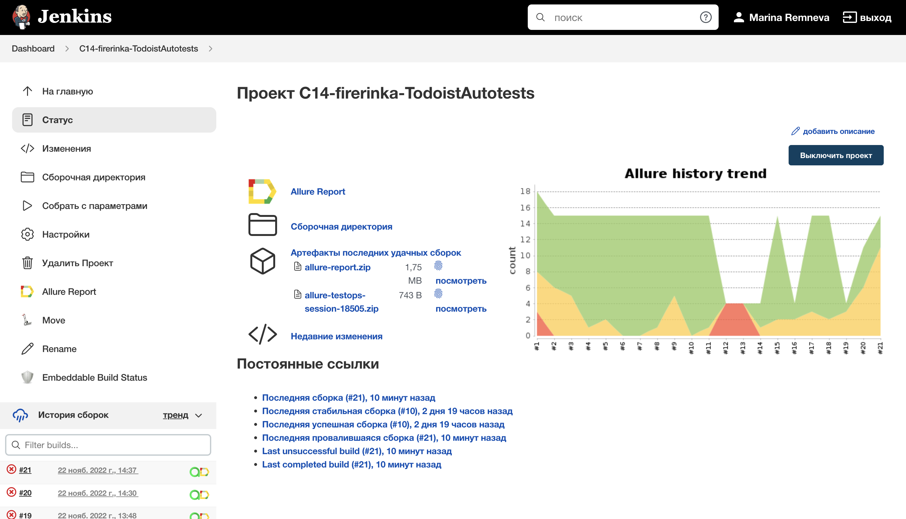
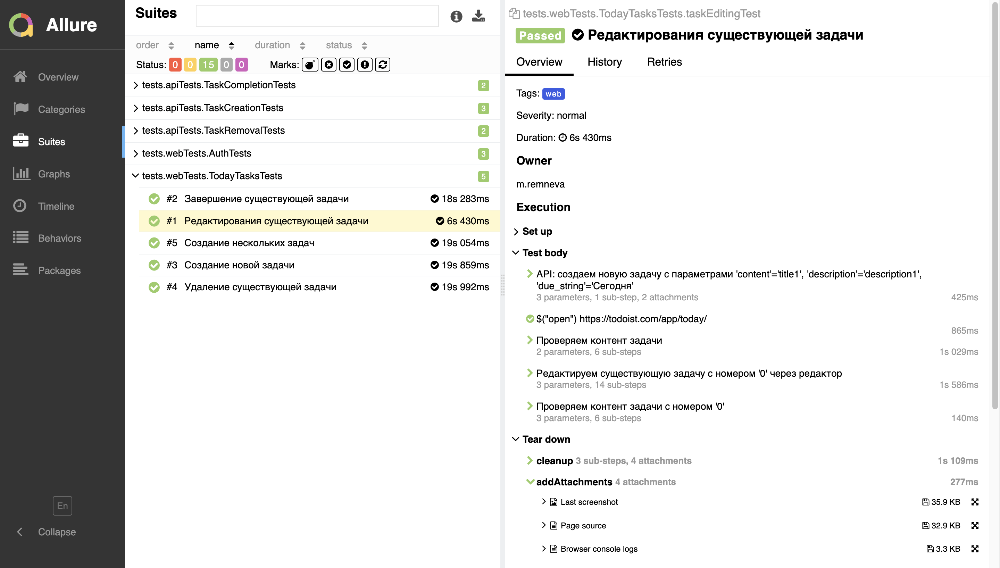
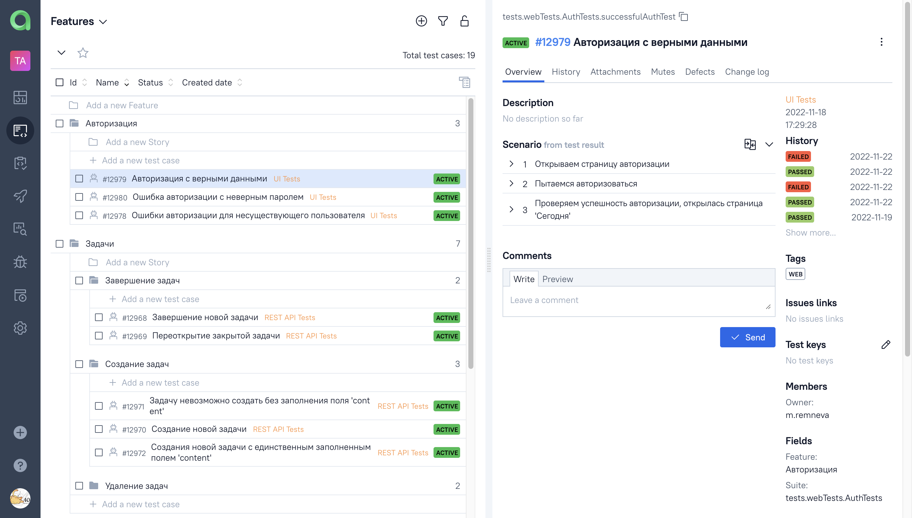
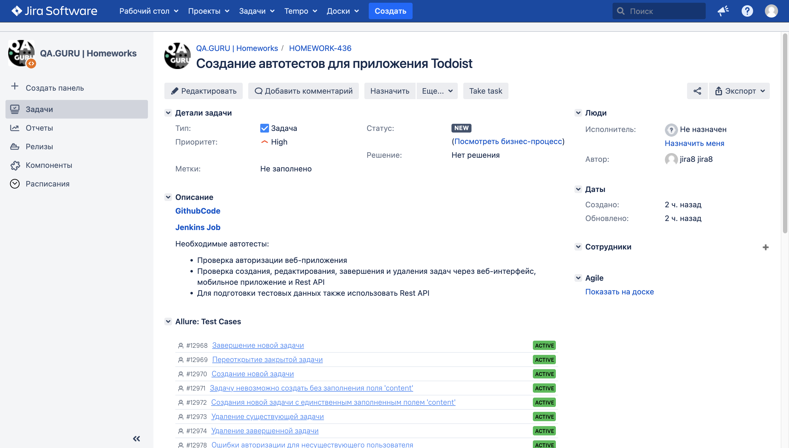
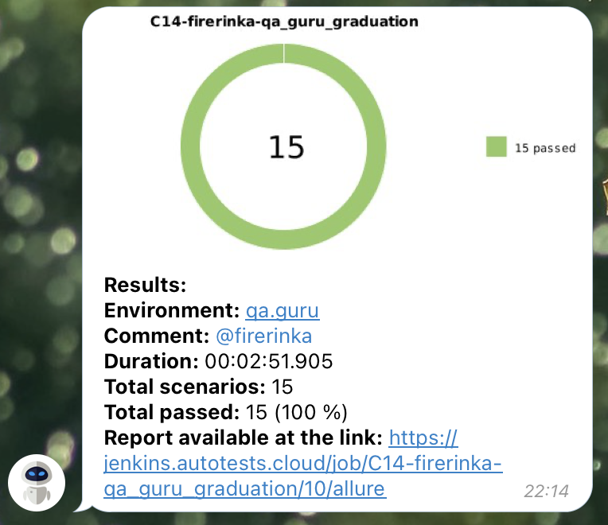
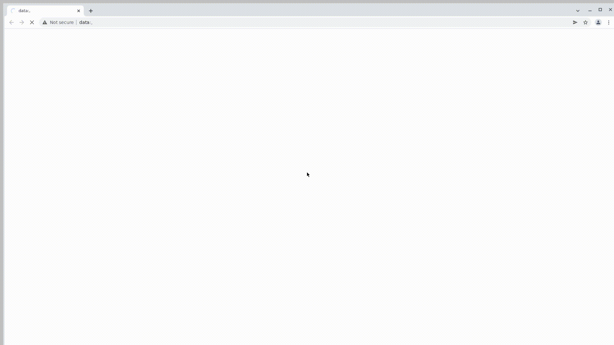
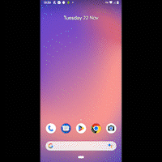

# Проект по автоматизации тестирования приложения Todoist


## :pushpin: Содержание:

- [Описание](#open_book-описание)
- [Использованный стек технологий](#computer-использованный-стек-технологий)
- [Запуск тестов](#running_woman-запуск-тестов)
- [Сборка в Jenkins](#-сборка-в-jenkins)
- [Пример Allure-отчета](#-пример-allure-отчета)
- [Интеграция с Allure TestOps](#-интеграция-с-allure-testops)
- [Интеграция с Jira](#интеграция-с-jira)
- [Уведомления в Telegram с использованием бота](#-уведомления-в-telegram-с-использованием-бота)
- [Примеры видео запуска тестов в Selenoid и Browserstack](#-примеры-видео-запуска-тестов-в-selenoid-и-browserstack)

## :open_book: Описание
В проекте реализованы UI, API и Mobile тесты для веб и мобильного приложения Todoist.

## :computer: Использованный стек технологий

<p align="center">
<code></code>
<code></code>
<code></code>
<code></code>
<code></code>
<code></code>
<code></code>
<code></code>
<code></code>
<code></code>
<code></code>
<code></code>
<code></code>
<code></code>
<code></code>
</p>

Автотесты написаны на <code>Java</code> с использованием <code>JUnit 5</code> и <code>Gradle</code>.
Для UI-тестов использован фреймворк [Selenide](https://selenide.org/).
API тесты используют фреймворк [RestAssured](https://rest-assured.io/).
Автотесты для мобильных устройств написаны с помощью [Selenide](https://selenide.org/) и [Appium](https://appium.io/).
Запуск тестов можно осуществлять локально или в [Selenoid](https://aerokube.com/selenoid/) и [Browserstack](https://www.browserstack.com/).
Также реализована сборка в <code>Jenkins</code> с формированием Allure-отчета и отправкой уведомления с результатами в <code>Telegram</code> после завершения прогона.

Allure-отчет включает в себя:
* шаги выполнения тестов;
* логирование отправленных API запросов
* скриншот страницы в браузере в момент окончания автотеста;
* Page Source;
* логи браузерной консоли;
* видео выполнения автотеста.

## :running_woman: Запуск тестов

### Локальный запуск тестов
Запуск web-тестов
```
gradle clean webTests -Denv=local
```
Запуск тестов на мобильное приложение в эмуляторе
```
gradle clean mobileTests -Denv=local -DdeviceHost=emulation
```


При необходимости можно переопределить параметры запуска
```
gradle clean webTests
-Denv=local
-Dbrowser=${BROWSER_NAME}
-DbrowserVersion=${BROWSER_VERSION}
-DbrowserSize=${BROWSER_SIZE}
-DbaseUrl=${BASE_URL}
```

### Запуск тестов на удаленном браузере
Для запуска web-тестов в selenoid
```
gradle clean webTests -Denv=remote
```

Запуск тестов на мобильное приложение в Browserstack
```
gradle clean mobileTests -Denv=remote -DdeviceHost=browserstack
```

При необходимости также можно переопределить параметры запуска

```
gradle clean webTests -Denv=remote
-Dbrowser=${BROWSER_NAME}
-DbrowserVersion=${BROWSER_VERSION}
-DbrowserSize=${BROWSER_SIZE}
-DbaseUrl=${BASE_URL}
-DremoteUrl=${REMOTE_BROWSER_URL}
```

### Параметры сборки

* <code>BROWSER_NAME</code> – браузер, в котором будут выполняться тесты. По-умолчанию - <code>chrome</code>.
* <code>BROWSER_VERSION</code> – версия браузера, в которой будут выполняться тесты. По-умолчанию - <code>105.0</code>.
* <code>BROWSER_SIZE</code> – размер окна браузера, в котором будут выполняться тесты.
* <code>BASE_URL</code> – Url, по которому будет открываться тестируемое приложение. По-умолчанию - <code>1920x1080</code>.
* <code>REMOTE_BROWSER_URL</code> – адрес удаленного сервера, на котором будут запускаться тесты.

##  Сборка в Jenkins
<p align="center">

</p>

##  Пример Allure-отчета
### Overview

<p align="center">

</p>

### Результат выполнения теста

<p align="center">

</p>

###  Интеграция с Allure TestOps
Тестовая сборка в Jenkins интегрирована с Allure TestOps. В Allure TestOps автоматически обновляется список тест-кейсов и результаты выполнения тестов.
<p align="center">

</p>

### Интеграция с Jira
Также полученные из автотестов тест-кейсы прикреплены к задаче в Jira.
<p align="center">

</p>

###  Уведомления в Telegram с использованием бота

После завершения сборки специальный бот, созданный в <code>Telegram</code>, автоматически обрабатывает и отправляет сообщение с отчетом о прогоне.

<p align="center">

</p>

###  Примеры видео запуска тестов в Selenoid и Browserstack

При запуске тестов в remote-окружении к каждому тесту в отчете прилагается видео.
<p>Пример видео из Selenoid</p>
<p align="center">
  
</p>

Пример видео из Browserstack
<p align="center">
  
</p>